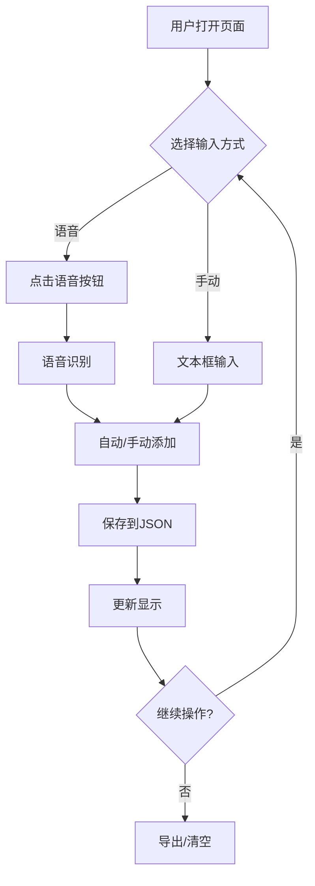

# 药品信息收集器 - 设计文档

## 1. 项目概述

### 1.1 项目目标
开发一个基于Gradio的Web应用，支持通过语音和手动输入收集药品信息，并进行持久化存储和管理。

### 1.2 核心功能
- 🎤 **语音输入**: 单次模式和连续模式
- ✍️ **手动输入**: 文本框输入
- 📊 **数据展示**: 可读表格显示（最新在上）
- 💾 **数据持久化**: JSON文件存储
- 📥 **数据导出**: 导出为TXT文件
- 🗑️ **数据管理**: 清空所有数据

### 1.3 技术栈
- **前端框架**: Gradio 5.49.1
- **语音识别**: Web Speech API (浏览器原生)
- **后端语言**: Python 3.10+
- **数据存储**: JSON文件
- **测试框架**: pytest

---

## 2. 系统架构

### 2.1 分层架构

```
┌─────────────────────────────────────┐
│         Presentation Layer          │
│         (Gradio UI)                 │
├─────────────────────────────────────┤
│         Business Logic Layer        │
│    (Entry Management, Validation)   │
├─────────────────────────────────────┤
│         Data Access Layer           │
│      (JSON File Storage)            │
├─────────────────────────────────────┤
│         Data Model Layer            │
│      (Entry, EntryList)             │
└─────────────────────────────────────┘
```

### 2.2 模块划分

```
src/
├── models.py       # 数据模型 (Entry, EntryList)
├── storage.py      # 存储层 (JSONStorage)
├── service.py      # 业务逻辑 (EntryService)
├── ui.py          # UI组件 (GradioUI)
└── voice.py       # 语音识别 (JavaScript代码)
```

---

## 3. 数据模型

### 3.1 Entry (条目)

```python
@dataclass
class Entry:
    id: int                  # 唯一标识 (毫秒时间戳)
    text: str               # 药品信息文本
    timestamp: str          # 录入时间 "YYYY-MM-DD HH:MM:SS"

    def to_dict(self) -> dict
    @classmethod
    def from_dict(cls, data: dict) -> Entry
    def to_dataframe_row(self, number: int) -> list
```

### 3.2 EntryList (条目列表)

```python
class EntryList:
    entries: List[Entry]

    def add(self, text: str) -> Entry
    def get_all(self) -> List[Entry]
    def get_reversed(self) -> List[Entry]
    def clear(self) -> None
    def to_dict_list(self) -> List[dict]
    def to_dataframe(self) -> List[list]
    @classmethod
    def from_dict_list(cls, data: List[dict]) -> EntryList
```

---

## 4. 核心功能设计

### 4.1 语音输入

#### 4.1.1 单次模式
1. 用户点击"🎤 单次语音输入"
2. 浏览器请求麦克风权限
3. Web Speech API开始识别
4. 识别结果填充到文本框
5. 用户点击"添加到列表"

#### 4.1.2 连续模式 (推荐)
1. 用户点击"🔴 连续语音输入"
2. 浏览器请求麦克风权限
3. 识别结果自动添加到列表
4. 识别结束后自动重启，持续循环
5. 再次点击按钮停止

#### 4.1.3 技术实现
- 使用Web Speech API (`webkitSpeechRecognition`)
- 语言设置: `zh-CN` (中文)
- 连续模式通过`onend`事件循环重启
- 使用状态标志防止重复启动

### 4.2 数据管理

#### 4.2.1 添加流程
```
输入文本 → 验证非空 → 创建Entry → 保存到Storage → 更新UI
```

#### 4.2.2 存储格式
```json
[
  {
    "id": 1763412159088,
    "text": "阿莫西林一盒2027年3月。",
    "timestamp": "2025-11-17 20:42:39"
  }
]
```

#### 4.2.3 显示格式
- Gradio Dataframe组件
- 列: [序号, 药品信息, 录入时间, ID]
- 排序: 最新的在最上面 (倒序)
- 只读模式 (防止误操作)

### 4.3 数据导出

#### 4.3.1 导出格式 (TXT)
```
1. 阿莫西林一盒2027年3月。
2. 依托考昔一盒，2027年6月。
3. 秋水仙碱一盒2028年3月。
```

#### 4.3.2 文件名
```
medicine_list_YYYYMMDD_HHMMSS.txt
```

---

## 5. 安全性设计

### 5.1 数据完整性
- ✅ 所有写操作立即持久化
- ✅ 移除危险的"保存修改"按钮
- ✅ Dataframe设为只读，防止误操作覆盖
- ✅ 清空操作使用醒目的"stop"样式提醒

### 5.2 输入验证
- 空字符串检查
- 文本去除首尾空格
- ID唯一性保证 (毫秒时间戳)

### 5.3 错误处理
- 文件读取失败 → 返回空列表
- JSON解析失败 → 返回空列表
- 语音识别失败 → 提示用户

---

## 6. 用户界面设计

### 6.1 布局结构

```
┌──────────────────────────────────────┐
│  标题: 药品信息收集器                  │
│  统计: 已收集 X 条                    │
├──────────────────────────────────────┤
│  语音输入区域                         │
│  ┌─────────┐  ┌──────────────┐      │
│  │单次语音  │  │连续语音(推荐) │      │
│  └─────────┘  └──────────────┘      │
│  [文本框: 识别结果/手动输入]          │
│  [➕ 添加到列表]                      │
├──────────────────────────────────────┤
│  收集列表 (Dataframe)                 │
│  # | 药品信息 | 录入时间 | ID         │
│  3 | xxx     | xxx     | xxx        │
│  2 | xxx     | xxx     | xxx        │
│  1 | xxx     | xxx     | xxx        │
│                                      │
│  [🔄刷新] [📥导出] [🗑️清空]          │
├──────────────────────────────────────┤
│  使用说明                             │
└──────────────────────────────────────┘
```

### 6.2 交互流程



---

## 7. 测试策略

### 7.1 单元测试

#### 7.1.1 models.py
- `test_entry_creation`: 创建Entry对象
- `test_entry_to_dict`: Entry序列化
- `test_entry_from_dict`: Entry反序列化
- `test_entrylist_add`: 添加条目
- `test_entrylist_to_dataframe`: 转换为Dataframe格式

#### 7.1.2 storage.py
- `test_save_and_load`: 保存和加载
- `test_load_empty_file`: 加载空文件
- `test_load_nonexistent_file`: 加载不存在的文件
- `test_save_empty_list`: 保存空列表

#### 7.1.3 service.py
- `test_add_entry`: 添加条目
- `test_add_empty_entry`: 添加空条目
- `test_clear_all`: 清空所有
- `test_export_text`: 导出文本

### 7.2 集成测试
- `test_end_to_end_workflow`: 完整流程测试
- `test_data_persistence`: 数据持久化测试

### 7.3 测试覆盖率目标
- 代码覆盖率: > 85%
- 核心功能覆盖率: 100%

---

## 8. 部署和运行

### 8.1 环境要求
- Python 3.10+
- 浏览器: Chrome / Edge (支持Web Speech API)

### 8.2 安装依赖
```bash
pip install -r requirements.txt
```

### 8.3 运行应用
```bash
python app.py
```

### 8.4 运行测试
```bash
pytest tests/ -v --cov=src
```

---

## 9. 未来扩展

### 9.1 短期计划
- [ ] 添加药品分类功能
- [ ] 添加过期日期提醒
- [ ] 支持编辑单条记录
- [ ] 添加搜索功能

### 9.2 长期计划
- [ ] 多用户支持
- [ ] 数据库存储 (SQLite/PostgreSQL)
- [ ] OCR识别药盒
- [ ] 移动端适配
- [ ] 云端同步

---

## 10. 版本历史

### v3.0 (2025-11-17)
- ✅ 使用Gradio Dataframe原生组件
- ✅ 移除危险的"保存修改"按钮
- ✅ Dataframe改为只读模式
- ✅ 添加完整的单元测试
- ✅ 规范化项目结构

### v2.0 (2025-11-16)
- 添加连续语音模式
- 修复语音识别循环bug
- 改进UI布局

### v1.0 (2025-11-16)
- 初始版本
- 单次语音输入
- JSON存储

---

## 附录

### A. 数据流图

```
┌──────────┐     ┌──────────┐     ┌──────────┐     ┌──────────┐
│ 语音识别  │────>│  添加条目 │────>│  保存JSON │────>│  更新UI   │
└──────────┘     └──────────┘     └──────────┘     └──────────┘
                      ▲
                      │
                 ┌──────────┐
                 │ 手动输入  │
                 └──────────┘
```

### B. 目录结构

```
solution3/
├── src/
│   ├── __init__.py
│   ├── models.py          # 数据模型
│   ├── storage.py         # 存储层
│   ├── service.py         # 业务逻辑
│   ├── ui.py             # UI组件
│   └── voice.py          # 语音JS代码
├── tests/
│   ├── __init__.py
│   ├── test_models.py
│   ├── test_storage.py
│   └── test_service.py
├── data/
│   └── voice_entries.json # 数据文件
├── app.py                # 主入口
├── config.py             # 配置
├── requirements.txt      # 依赖
├── DESIGN.md            # 本文档
└── README.md            # 使用说明
```
